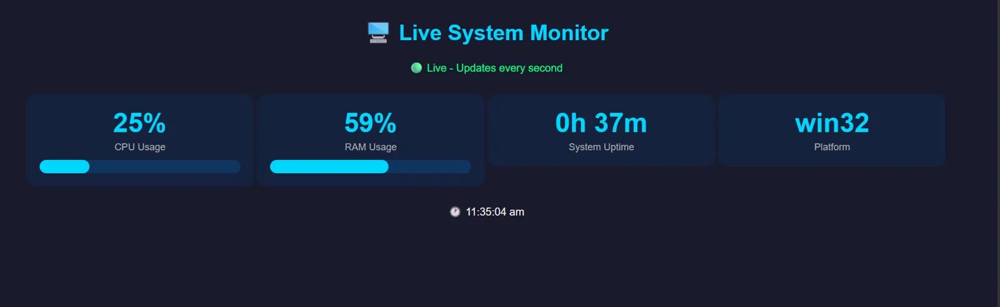

notepad README.md
```

Paste this:
```
# 🖥️ Real-time System Monitor

## Project Overview
A live system monitoring dashboard built with TypeScript and WebSockets 
that displays real-time CPU, RAM, uptime and platform data — 
updating every second automatically.

## 🚀 Features
- Live CPU usage with progress bar
- Live RAM usage with progress bar  
- System uptime tracking
- Platform detection
- Updates every second via WebSockets
- Beautiful dark themed dashboard

## 🛠️ Technologies Used
- TypeScript
- Node.js
- Express.js
- WebSockets (ws library)
- HTML/CSS
- systeminformation library

## ⚡ Architecture
- Backend: TypeScript + Express + WebSocket Server
- Frontend: HTML + CSS + WebSocket Client
- Data: Real system metrics via systeminformation

## 📸 Screenshot


## ▶️ How to Run
1. Clone the repository
2. Run: npm install
3. Run: npx ts-node server.ts
4. Open: http://localhost:3000

## 💡 Use Case
Real-time server monitoring — used in DevOps and 
cloud infrastructure management
